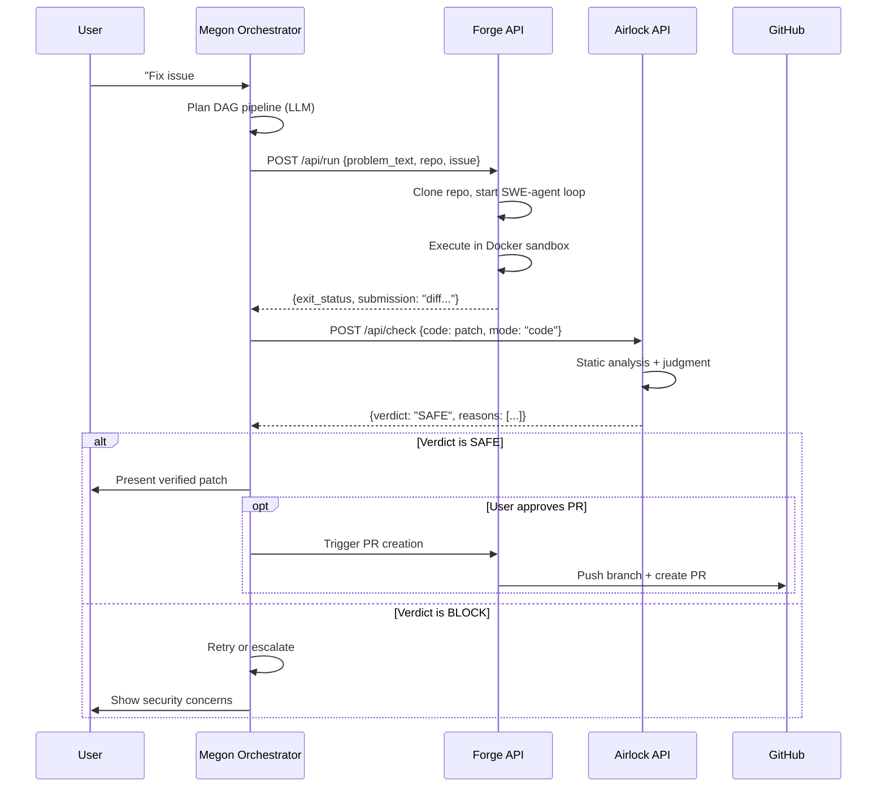

# Megon 3.0 — Architecture

Decentralized autonomous AI software-engineering network designed to run
AI workloads on the **Nosana decentralized GPU network**.

---

## High-Level Architecture

```
                    USER
                     │
                     ▼
                MEGON 3.0
                     │
                 Planner
                     │
          ┌──────────┼──────────┐
          ▼          ▼          ▼
      Research    Coding     Security
       Agent       Agent       Agent
          │          │          │
          └──────────┼──────────┘
                     ▼
              Verification
                     │
                     ▼
               Final Result

        Decentralized Execution (Nosana)
                     │
                     ▼
             NOSANA NETWORK
                     │
              ┌──────┼──────┐
              ▼      ▼      ▼
             GPU    GPU    GPU
           Worker Worker Worker
```

Nosana is not an optional hosting provider. It is the intended decentralized
compute layer for Megon's agent workloads. Each agent (research, coding,
security) can execute on a separate GPU worker node in the Nosana network,
providing censorship-resistant, community-owned AI infrastructure.

---

## System Component Diagram

```mermaid
graph TB
    subgraph User["User Interface"]
        UI[React 19 Frontend<br/>Vite + ReactFlow + TailwindCSS]
        Chat[Chat Panel<br/>Socket.IO]
        Canvas[Mission Canvas<br/>DAG Visualization]
        Fleet[Fleet Dashboard<br/>GPU Pricing & Status]
        UI --> Chat
        UI --> Canvas
        UI --> Fleet
    end

    subgraph Orchestrator["Megon 3.0 Planner (AgentForge)"]
        Nginx[Nginx Reverse Proxy<br/>:3000]
        Eliza[ElizaOS v2 Runtime<br/>:3002]
        FleetAPI[Fleet API Express<br/>:3001 + Socket.IO]
        Plugin[Nosana Plugin<br/>plugin-nosana]
        MVP[MVP Orchestrator<br/>megon/orchestrator.mjs]
        Nginx --> Eliza
        Nginx --> FleetAPI
        Eliza --> Plugin
        FleetAPI --> Plugin
        MVP -.->|lightweight alternative| Eliza
    end

    subgraph Agents["Agent Orchestration"]
        Planner[Planner Agent<br/>LLM Pipeline Planning]
        Researcher[Research Agent<br/>Web Search + Analysis]
        Coder[Coding Agent<br/>Forge on GPU]
        Security[Security Agent<br/>Airlock Verification]
        Tester[Testing Agent<br/>Sandboxed Execution]
        Planner --> Researcher
        Researcher --> Coder
        Coder --> Security
        Security --> Tester
    end

    subgraph Forge["Forge (Autonomous Coding)"]
        ForgeAPI[Axum HTTP API<br/>:5000]
        ForgeCLI[Forge CLI Binary]
        ForgeAgent[SWE-Agent Loop<br/>forge-agent crate]
        ForgeEnv[Docker Sandbox<br/>bollard / E2B]
        ForgeAPI --> ForgeAgent
        ForgeCLI --> ForgeAgent
        ForgeAgent --> ForgeEnv
    end

    subgraph Airlock["Airlock (Security Gate)"]
        AirlockAPI[HTTP Wrapper<br/>:5001]
        Gate[gate.check()<br/>Orchestrator]
        Detonate[Daytona Sandbox<br/>Detonation]
        StaticRead[Nosana GPU<br/>Static Analysis]
        Judge[ai& LLM<br/>Verdict Engine]
        AirlockAPI --> Gate
        Gate --> Detonate
        Gate --> StaticRead
        Gate --> Judge
    end

    subgraph Nosana["Nosana Decentralized GPU Network"]
        SDK[@nosana/kit SDK v2.2.4]
        Markets[GPU Markets<br/>3090/4090/A100/H100]
        GPU1[GPU Worker Node 1]
        GPU2[GPU Worker Node 2]
        GPU3[GPU Worker Node 3]
        SDK --> Markets
        Markets --> GPU1
        Markets --> GPU2
        Markets --> GPU3
    end

    subgraph External["External Services"]
        GitHub[GitHub API<br/>Issues, PRs, Webhooks]
        Tavily[Tavily<br/>Web Search]
        Daytona[Daytona<br/>Disposable Sandboxes]
        aiand[ai&<br/>LLM Judgment]
        OpenRouter[OpenRouter<br/>Free LLM Inference]
    end

    Chat -->|Socket.IO| Nginx
    Canvas -->|HTTP Poll 2s| FleetAPI
    Fleet -->|HTTP Poll 5s| FleetAPI
    Plugin -->|Deploy Workers| SDK
    Plugin -->|HTTP to Forge| ForgeAPI
    Plugin -->|HTTP to Airlock| AirlockAPI
    ForgeEnv -->|Code Execution| Docker[(Docker<br/>Sandbox Containers)]
    Coder -.->|runs via| ForgeAPI
    Security -.->|runs via| AirlockAPI
    Researcher -.->|deployed to| GPU1
    Coder -.->|deployed to| GPU2
    StaticRead -.->|code model on| GPU3
    ForgeAgent -->|GitHub Issues/PRs| GitHub
    Researcher -->|Web Search| Tavily
    Detonate -->|Create Sandbox| Daytona
    Judge -->|LLM Call| aiand
    MVP -->|LLM Inference| OpenRouter
```

---

## Data Flow: Coding Task



---

## Nosana Decentralized Execution Model

Megon 3.0 is architected so that every agent workload can execute on a
Nosana GPU worker node:

1. **Orchestrator on Nosana:** The entire AgentForge stack deploys to a
   Nosana GPU node using `nos_job_def/nosana_eliza_job_definition.json`.

2. **Coding Agent on Nosana:** Forge runs as a Nosana job via
   `nos_job_def/forge_job_definition.json`, executing the forge-api binary
   on decentralized GPU hardware.

3. **Security Analysis on Nosana:** Airlock's static read step uses a
   Nosana-hosted code model (e.g., Qwen2.5-Coder-7B) for source analysis.

4. **Unified Deployment:** `Dockerfile.nosana` packages all three services
   into a single container image deployable via `nosana/megon_job_definition.json`.

5. **Market Selection:** AgentForge's NosanaManager automatically selects
   the cheapest available GPU market with sufficient VRAM.

The local MVP and Nosana deployment share the same agent workflow.
Transitioning requires only adding Nosana credentials — no code changes.

---

## Component Responsibilities

| Component | Language | Role | Port |
|-----------|----------|------|------|
| MVP Orchestrator | Node.js | Lightweight pipeline (Plan→Code→Verify→Test) | - |
| Frontend | TypeScript/React | UI, DAG canvas, chat, fleet dashboard | 5173 (dev) |
| Nginx | Config | Reverse proxy, static file serving | 3000 |
| ElizaOS | TypeScript | Full agent runtime, plugin system | 3002 |
| Fleet API | TypeScript/Express | Mission management, Socket.IO | 3001 |
| Nosana Plugin | TypeScript | GPU deployment, worker communication | - |
| Forge API | Rust/Axum | Autonomous coding, sandbox execution | 5000 |
| Airlock API | Python/FastAPI | Security verification service | 5001 |
| Airlock Core | Python | Detonation, analysis, judgment | - |

---

*Architecture prepared for Nosana decentralized deployment.*
