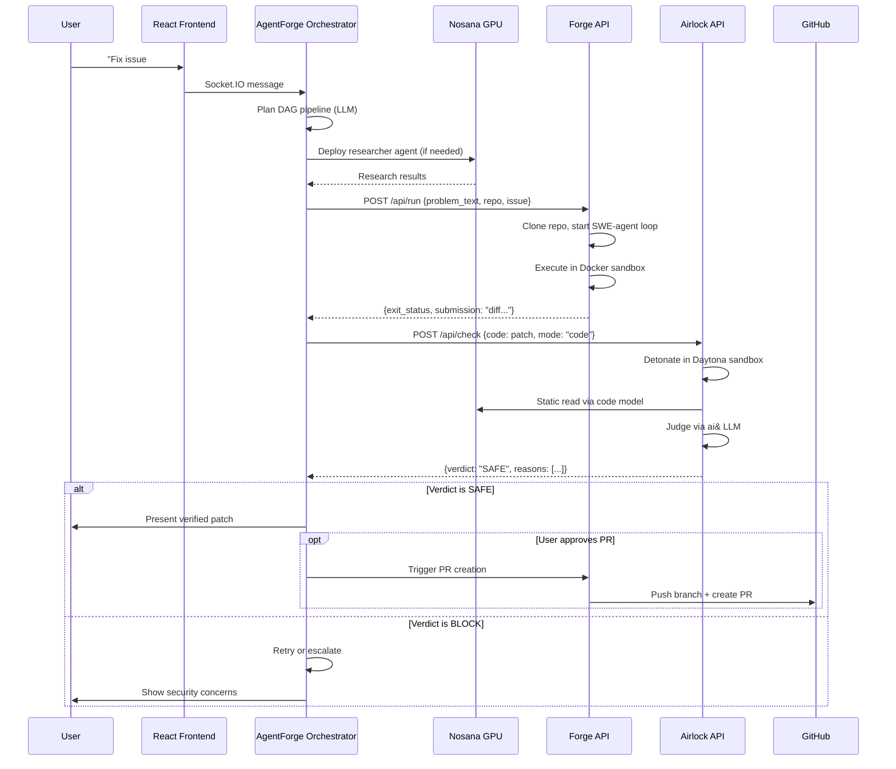

# Megon 3.0 — Architecture

Decentralized autonomous AI software-engineering network running AI workloads
on the Nosana decentralized GPU network.

---

## System Architecture Diagram

```mermaid
graph TB
    subgraph User["User Interface"]
        UI[React 19 Frontend<br/>Vite + ReactFlow + TailwindCSS]
        Chat[Chat Panel<br/>Socket.IO]
        Canvas[Mission Canvas<br/>DAG Visualization]
        Fleet[Fleet Dashboard<br/>GPU Pricing & Status]
        UI --> Chat
        UI --> Canvas
        UI --> Fleet
    end

    subgraph Orchestrator["Megon 3.0 Planner (AgentForge)"]
        Nginx[Nginx Reverse Proxy<br/>:3000]
        Eliza[ElizaOS v2 Runtime<br/>:3002]
        FleetAPI[Fleet API Express<br/>:3001 + Socket.IO]
        Plugin[Nosana Plugin<br/>plugin-nosana]
        Nginx --> Eliza
        Nginx --> FleetAPI
        Eliza --> Plugin
        FleetAPI --> Plugin
    end

    subgraph Agents["Agent Orchestration (Nosana GPU Network)"]
        Planner[Planner Agent<br/>LLM Pipeline Planning]
        Researcher[Research Agent<br/>Web Search + Analysis]
        Coder[Coding Agent<br/>Forge on Nosana GPU]
        Security[Security Agent<br/>Airlock Verification]
        Tester[Testing Agent<br/>Forge Sandbox]
        Planner --> Researcher
        Researcher --> Coder
        Coder --> Security
        Security --> Tester
    end

    subgraph Forge["Forge (Autonomous Coding)"]
        ForgeAPI[Axum HTTP API<br/>:5000]
        ForgeCLI[Forge CLI Binary]
        ForgeAgent[SWE-Agent Loop<br/>forge-agent crate]
        ForgeEnv[Docker Sandbox<br/>bollard / E2B]
        ForgeAPI --> ForgeAgent
        ForgeCLI --> ForgeAgent
        ForgeAgent --> ForgeEnv
    end

    subgraph Airlock["Airlock (Security Gate)"]
        AirlockAPI[HTTP Wrapper<br/>:5001 NEW]
        Gate[gate.check()<br/>Orchestrator]
        Detonate[Daytona Sandbox<br/>Detonation]
        StaticRead[Nosana GPU<br/>Static Analysis]
        Judge[ai& LLM<br/>Verdict Engine]
        AirlockAPI --> Gate
        Gate --> Detonate
        Gate --> StaticRead
        Gate --> Judge
    end

    subgraph Nosana["Nosana Decentralized GPU Network"]
        SDK[@nosana/kit SDK v2.2.4]
        Markets[GPU Markets<br/>3090/4090/A100/H100]
        GPU1[GPU Worker Node 1]
        GPU2[GPU Worker Node 2]
        GPU3[GPU Worker Node 3]
        SDK --> Markets
        Markets --> GPU1
        Markets --> GPU2
        Markets --> GPU3
    end

    subgraph External["External Services"]
        GitHub[GitHub API<br/>Issues, PRs, Webhooks]
        Tavily[Tavily<br/>Web Search]
        Daytona[Daytona<br/>Disposable Sandboxes]
        aiand[ai&<br/>LLM Judgment]
        Doubleword[Doubleword<br/>Malware Embeddings]
    end

    Chat -->|Socket.IO| Nginx
    Canvas -->|HTTP Poll 2s| FleetAPI
    Fleet -->|HTTP Poll 5s| FleetAPI
    Plugin -->|Deploy Workers| SDK
    Plugin -->|HTTP to Forge| ForgeAPI
    Plugin -->|HTTP to Airlock| AirlockAPI
    ForgeEnv -->|Code Execution| Docker[(Docker<br/>Sandbox Containers)]
    Coder -.->|runs via| ForgeAPI
    Security -.->|runs via| AirlockAPI
    Researcher -.->|deployed to| GPU1
    Coder -.->|deployed to| GPU2
    StaticRead -.->|code model on| GPU3
    ForgeAgent -->|GitHub Issues/PRs| GitHub
    Researcher -->|Web Search| Tavily
    Detonate -->|Create Sandbox| Daytona
    Judge -->|LLM Call| aiand
    Gate -->|Similarity| Doubleword
```

---

## Data Flow: Coding Task



---

## Component Responsibilities

| Component | Language | Role | Port |
|-----------|----------|------|------|
| Frontend | TypeScript/React | UI, DAG canvas, chat, fleet dashboard | 5173 (dev) |
| Nginx | Config | Reverse proxy, static file serving | 3000 |
| ElizaOS | TypeScript | Agent runtime, plugin system | 3002 |
| Fleet API | TypeScript/Express | Mission management, Socket.IO | 3001 |
| Nosana Plugin | TypeScript | GPU deployment, worker communication | - |
| Forge API | Rust/Axum | Autonomous coding, sandbox execution | 5000 |
| Forge CLI | Rust/Clap | One-shot coding tasks | - |
| Airlock API | Python/FastAPI | Security verification service | 5001 |
| Airlock Core | Python | Detonation, analysis, judgment | - |

---

## Nosana GPU Utilization Strategy

1. **Orchestrator Deployment:** The entire AgentForge stack can run on a Nosana
   GPU node using `nos_job_def/nosana_eliza_job_definition.json`.

2. **Worker Agents:** Research, analysis, and writing agents are deployed as
   individual ElizaOS workers to Nosana GPU nodes via NosanaManager.

3. **Forge on Nosana:** The Forge coding agent can be deployed to Nosana using
   `nos_job_def/forge_job_definition.json`, running the forge-api binary.

4. **Airlock Static Read:** Uses a Nosana-hosted code model (e.g.,
   Qwen2.5-Coder-7B) for static source analysis via OpenAI-compatible endpoint.

5. **Market Selection:** AgentForge's NosanaManager automatically selects the
   cheapest available GPU market with sufficient VRAM for each workload type.

---

*Architecture frozen for Phase 1-6. Implementation begins in Phase 7.*
