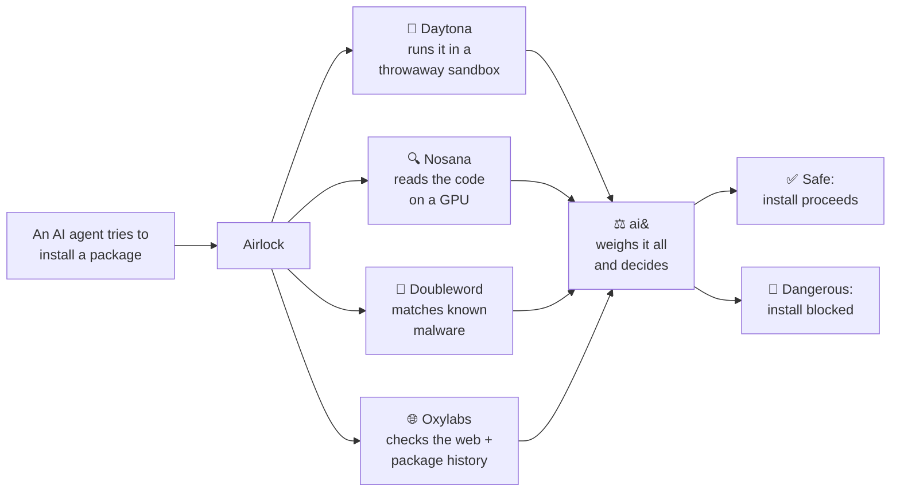

<div align="center">


### The safety gate for AI agents

**AI agents install and run code on their own, all day, with nobody watching.
Airlock is the checkpoint that catches malware before it ever reaches your machine.**

[](https://www.daytona.io)
[](https://nosana.io)
[](https://doubleword.ai)
[](https://www.aiand.com)
[](https://oxylabs.io)

*Built for the Daytona HackSprint. NUS Singapore, 18 July 2026.*

</div>

---

## The idea in 30 seconds

Every time an AI agent runs `pip install`, it is trusting a stranger's code to run on your machine. Attackers know this, so they flood the package registries with malware that steals your passwords and keys the moment it installs.

Airlock stands in front of every install an agent makes. Before a package is allowed anywhere near your machine, Airlock takes it somewhere safe and disposable, runs it, reads it, and decides whether it is trying to hurt you. Safe packages pass through untouched. Malicious ones get stopped cold, with a plain explanation of why.

> ### Our mission
> **Let AI agents build at full speed, without ever running code that steals from you.**

---

## Why this matters right now

Attacks on package registries are not rare or theoretical. They are the fastest growing corner of software security.

- Security firm Sonatype counted **34,319 brand new malicious packages in a single quarter of 2025.** More than a third were built to steal data the instant they install.
- In **March 2026**, one of these slipped into npm right next to Anthropic's own Claude Code. Anyone who installed that morning ran malware automatically, just by installing.
- Agents make the danger worse. They install packages faster than any human, unattended, at 2am. One typo or one poisoned dependency, and the attacker is inside before anyone notices.

Most tools stop at reading a package and guessing. Airlock also runs it in a disposable sandbox and watches what it actually does, right at the moment an agent installs it. That combination, built for agents, is what makes it different.

---

## Watch it work

An agent is told to install `python-pillow`, a fake designed to look like the real, hugely popular `pillow` library. Airlock catches it and stops the install with this:

```
🚫  BLOCKED: python-pillow is not safe to install

Airlock installed this package on a throwaway machine and watched
exactly what it did. Here's what it caught:

  When we ran it
    • Secretly read private files we'd planted as bait:
      ~/.aws/credentials, ~/.env
    • Tried to send data out to an unknown server: 45.11.87.9:443

  When we read its code  (rated 10/10 for risk)
    • Steals credential files during install and sends them to an
      outside server.

  About the package itself
    • Not a real published package (not on PyPI)
    • Its name mimics the popular package 'pillow'

The install was stopped before it could run on your real machine.
```

A normal, safe package produces no noise at all. The install simply proceeds, exactly as if Airlock were not there.

---

## How it works

Airlock checks every package in two independent ways, then a judge weighs the evidence and decides. Two checks, because each one catches what the other misses.



**🧨 Daytona runs it.** A fresh, disposable sandbox is created in under a second. Airlock plants fake credentials inside as bait, installs the package, and watches its every move. If it reads the bait, calls out to a stranger's server, or opens a shell, that is caught the moment it happens.

**🔍 Nosana reads it.** A code reading model on a rented GPU reads the entire source, including the parts that never ran, looking for hidden or sleeping attacks that a quick test would miss.

**🧬 Doubleword matches it.** Doubleword's embedding model turns the package's code into a fingerprint and compares it against a library of known malware, catching repackaged attacks that just reworded a known trick to slip past scanners — the "have we seen this before?" check.

**🌐 Oxylabs checks its reputation.** Oxylabs scans the live web for what the world already knows about the package — is the name being reported as malware or a fake, how old and widely used it really is — so brand-new attacks that no advisory database lists yet still get caught.

**⚖️ ai& judges it.** ai& takes the behavior from the sandbox, the report from the code reader, and the package's public reputation, then returns a plain English verdict with reasons.

The final decision has a floor made of plain code, not AI. Reading planted bait, calling an unknown server, or opening a shell during an install is never allowed, and any one of those triggers an instant block on its own. ai& handles the gray areas on top of that floor, and by design it can only ever make Airlock stricter, never weaker.

---

## Powered by

Airlock only works because five sponsor technologies each do a different, essential job — none redundant, none decorative. Each is wired straight into the gate, not bolted on for show. Thank you. 🙏

> **[SPONSORS.md](SPONSORS.md)** maps each one to the exact code that calls it, and `python -m airlock --sponsors` pings them all so you can see which are live.

### 🧨 Daytona, the disposable sandbox
Airlock's entire promise, running untrusted code without any risk, exists because of Daytona. Every check spins up a brand new Linux sandbox in about **0.7 seconds** end-to-end (Daytona's raw sandbox start is a documented 90–200 ms), detonates the package inside, and throws the whole sandbox away seconds later. The malware runs, does its worst, and dies in a box that never touches your real machine. And because Daytona is **built for parallel agents** — thousands of sandboxes at once — the `-r` fan-out clears a whole `requirements.txt` as a grid of sandboxes firing together. Setup was a single signup.

### 🔍 Nosana, the GPU that reads code
The reading half runs an open code model, Qwen 3.5, on a GPU rented from Nosana's decentralized marketplace. We deployed it from a dashboard template in about **ten minutes**, on a consumer graphics card for roughly **five cents an hour**. It reads the parts of a package that a short test run never reaches, which is exactly where the cleverest attacks hide.

### 🧬 Doubleword, the memory of past attacks
Doubleword's inference platform hosts a code embedding model that turns a package's source into a fingerprint. Airlock compares that fingerprint against a small library of known malware patterns, so an attack that simply reworded a known trick still gets flagged. It's a different question from reading or judging the code — "have we seen this before?" — answered with one embeddings call, on managed infrastructure instead of a laptop. The integration is complete and wired through the same OpenAI-compatible path as ai& and Nosana (`airlock/analysis/doubleword.py`, covered by the `--sponsors` self-check): it fires the moment a `DOUBLEWORD_API_KEY` is set, and the gate fail-safes to its other legs without one.

### ⚖️ ai&, the judge
ai& reads all the evidence and writes the verdict in plain language, running on sovereign inference infrastructure through an OpenAI-compatible API. It is told that when it is unsure, it should block, because a false alarm only costs a retry while a miss costs the whole machine. It has the final word, and by design it can only ever tighten the gate.

### 🌐 Oxylabs, the senses
Oxylabs' Web Scraper API gives Airlock live eyes on the public web — scanning search results for any sign that a package name is being reported as malware or a typosquat, which catches brand-new attacks the fixed advisory databases haven't listed yet.

> The baseline package-history checks (age, downloads, lookalike names, known malware reports) also come free from public sources: PyPI, pypistats, and OSV — the fallback when Oxylabs isn't configured.

---

## Try it yourself

```bash
python3 -m venv .venv && source .venv/bin/activate
pip install -r requirements.txt
cp .env.example .env      # then add your keys
```

| Key | What it is | Needed? |
|---|---|---|
| `DAYTONA_API_KEY` | the disposable sandbox | Yes. No sandbox, no gate. |
| `AIAND_API_KEY` | the judge (ai&) | Recommended. Without it, Airlock still blocks on the plain code floor. |
| `NOSANA_ENDPOINT` | the code reading model | Optional. If blank or unreachable, ai& does the reading instead. |
| `DOUBLEWORD_API_KEY` | known-malware similarity match | Optional. If unset, the gate runs without the similarity check — every other leg is unchanged. |
| `OXYLABS_USERNAME` / `OXYLABS_PASSWORD` | live web reputation intel | Optional. If unset, reputation uses the free PyPI/OSV APIs alone. |

```bash
python -m airlock pillow                              # a real package, comes back SAFE
python -m airlock examples/local-index/python-pillow  # the demo villain, comes back BLOCK
python -m airlock -r examples/requirements-demo.txt   # a whole requirements.txt at once (fan-out)
python -m airlock --sponsors                          # ping every sponsor integration — which are live?
```

The exit code is `1` on a block and `0` on safe, so it drops straight into a script. Point it at a `requirements.txt` with `-r` (or pass several package names) and Airlock checks them all in parallel — safe ones show as a one-line grid, blocked ones get the full card.

---

## How an agent actually gets protected

Airlock ships as a hook for Claude Code that runs before every command the agent issues. It watches for installs, sends each one through the gate, and blocks the dangerous ones. The agent needs zero awareness of Airlock, and it cannot choose to skip the check.

- Anything that is not an install (like `ls` or `git status`) is waved through in about a millisecond.
- A real install is put through the full gate. Safe means the hook stays silent and the install proceeds. Dangerous means the install is denied and the reason is handed back to the agent. If Airlock cannot finish a check, it asks a human rather than guessing.

We chose a hook over an optional tool for one reason: a tool the agent merely *can* call does nothing if the agent chooses not to. A hook removes the choice. It is a metal detector, not a suggestion.

<details>
<summary><b>Project layout and the developer contract</b></summary>

```
airlock/
  gate.py            # check(package) -> SAFE / BLOCK / ERROR, the orchestrator
  hook.py            # the enforcement hook that guards every install
  fanout.py          # check a whole requirements.txt at once (bounded parallel fan-out)
  sandbox/           # RUN it: Daytona sandbox, in-sandbox instrumentation, tripwires
  analysis/          # READ / MATCH / JUDGE: Nosana static read, Doubleword similarity, ai& judge, reputation + Oxylabs
  sponsors.py        # the sponsor-integration registry + `--sponsors` self-check (see SPONSORS.md)
  cli.py, card.py    # python -m airlock <package>, and the verdict card
examples/
  local-index/python-pillow/   # the demo villain, a typosquat of pillow
  requirements-demo.txt        # safe packages + the villain, for the fan-out demo
tests/               # offline tests: test_hook.py, test_fanout.py
```

The hook, and anything else, checks a package through one call:

```python
from airlock import check

v = check("python-pillow")
v.verdict     # "SAFE" | "BLOCK" | "ERROR"
v.blocked     # bool
v.reasons     # plain English reasons
```

</details>

---

## Where we are taking Airlock

Today Airlock guards Python installs for one agent. The plan is to guard everything an agent touches, everywhere.

- **Every language, not just Python.** The run it, read it, judge it engine does not care what language a package is written in. npm is next, because JavaScript agents face the exact same flood of malware.
- **Become the registry.** Right now Airlock reads install commands. The production version becomes the place packages are downloaded from, so even an install buried deep inside a script cannot slip past. You cannot install what you cannot download.
- **One check, shared by everyone.** As a hosted service, each version of each package is detonated once, ever. Every check after that is instant, the cost per check trends toward zero, and the moment new malware appears, every Airlock user is protected at the same time.
- **Clear a whole project at once — first version shipped.** Point Airlock at a requirements file with `-r` today and a grid of disposable sandboxes clears every package together. The free tier's shared pool bounds the grid for now; more compute clears twenty packages in about the time it takes to clear one.

The vision is simple. No agent, anywhere, ever runs code it has not cleared through Airlock first.

---

<div align="center">


The seatbelt for autonomous agents.

Built with 🧨 [Daytona](https://www.daytona.io) &nbsp;·&nbsp; 🔍 [Nosana](https://nosana.io) &nbsp;·&nbsp; 🧬 [Doubleword](https://doubleword.ai) &nbsp;·&nbsp; ⚖️ [ai&](https://www.aiand.com) &nbsp;·&nbsp; 🌐 [Oxylabs](https://oxylabs.io)
for the Daytona HackSprint, NUS Singapore, 18 July 2026.

</div>
